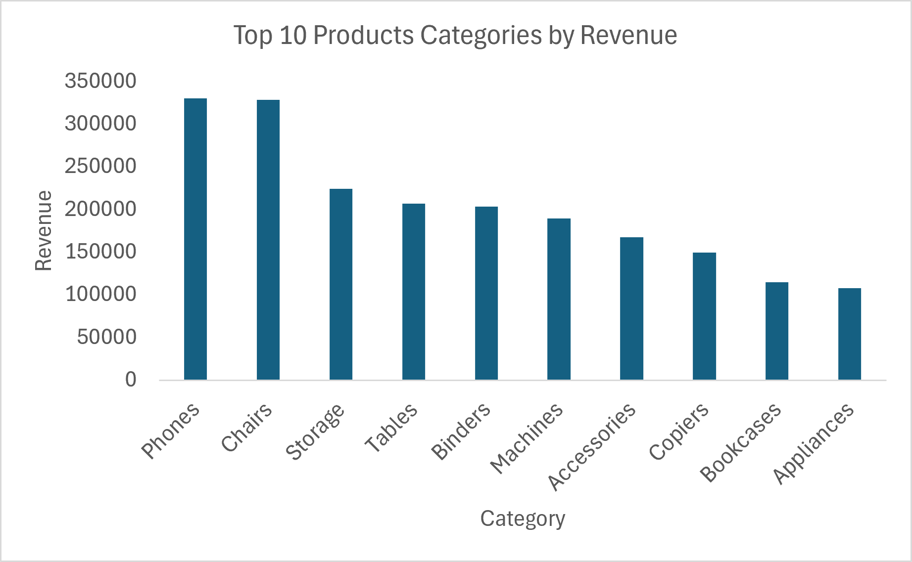
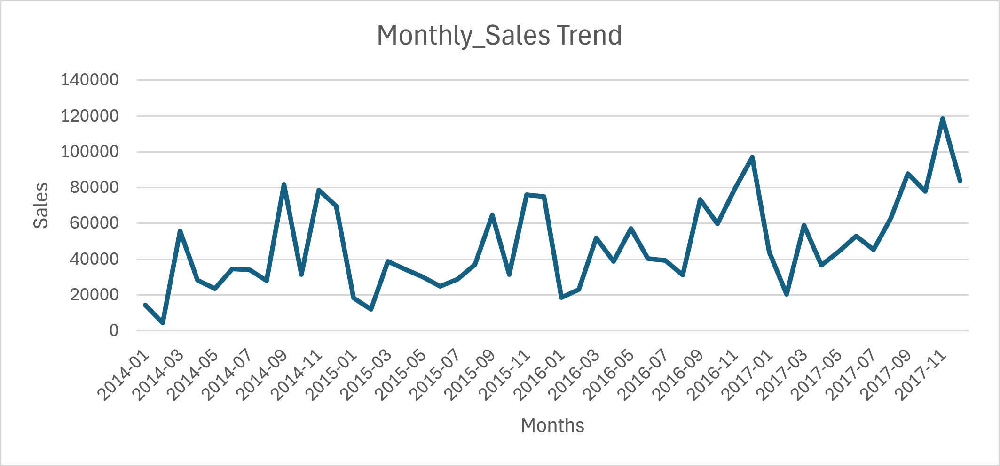
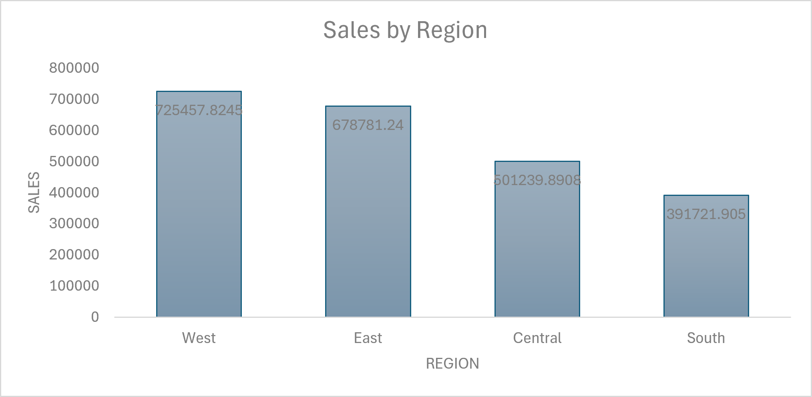
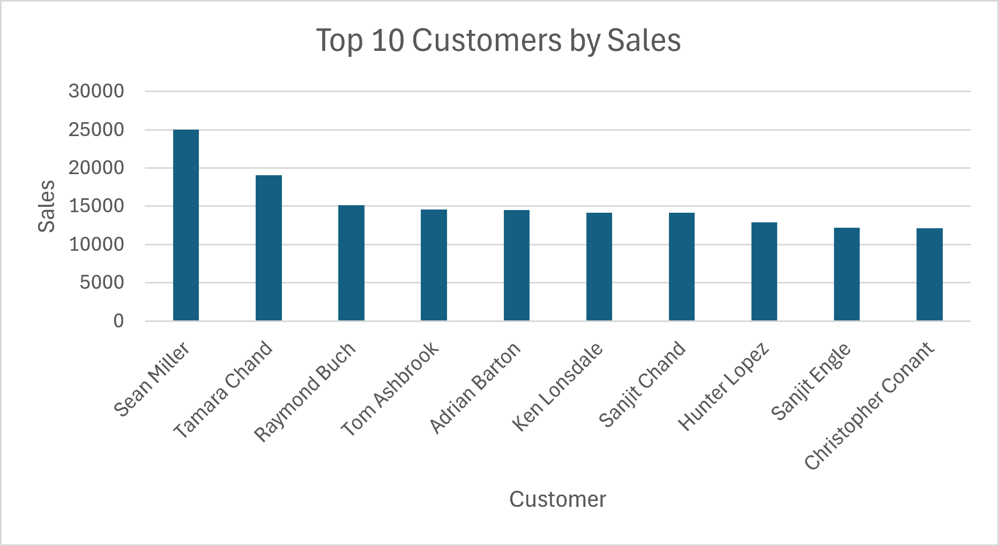

# ecommerce-sales-analysis

End-to-end SQL analytics project transforming raw Superstore sales data into actionable business insights on product performance, customer behaviour, regional sales, and monthly trends.

# 📊 E-commerce Sales Analysis (SQL Project)

## 🔍 Overview
This project analyses the Sample Superstore dataset to uncover revenue performance, customer concentration, regional contribution, and monthly sales patterns using SQL and Excel.

It demonstrates an end-to-end analytics workflow including:
- Data import into SQLite
- SQL querying and aggregation
- Exporting results into Excel
- Visualisation and business insight generation

---

## 🎯 Business / Analytical Questions
This project answers four key business questions:
1. Which product categories generate the most revenue?
2. How does sales performance change over time?
3. Which regions contribute the most revenue?
4. Which customers generate the highest sales value?

---

## 🗂️ Dataset
The project uses the Sample Superstore CSV dataset, imported into SQLite as an `orders` table.

---

## 🛠️ Tools Used
- SQLite / DB Browser for SQLite
- SQL
- Excel
- GitHub

---

## 🔄 Process (What I Did)
- Downloaded and extracted the Sample Superstore dataset
- Imported the CSV into SQLite as an `orders` table
- Wrote SQL queries to calculate total sales, top product categories, monthly sales trend, sales by region, and top customers by sales
- Exported query results into Excel
- Built four charts to communicate the findings clearly

---

## 📈 Key Visualizations

### Top 10 Product Categories by Revenue

Phones and Chairs dominate revenue performance, accounting for the highest sales among categories.

### Monthly Sales Trend

Monthly sales trend shows variation across time indicating possible seasonality

### Sales by Region

The West region is the strongest geographic market

### Top 10 Customers by Sales

A small group of customers contribute a large amount of the revenue

---

## 🔍 Key Insights
- Total sales reached $2,297,200.86
- Phones and Chairs were the highest revenue-generating product categories
- The West region generated the highest revenue, followed by the East
- Revenue is concentrated among a relatively small number of customers
- Monthly sales are not flat, suggesting time-based variation in sales performance

---

## 💼 Business Implications
This project shows how SQL-based analysis can support:
- product prioritisation
- regional strategy
- customer retention focus
- monthly performance tracking
- revenue-based decision-making

---

## 🧠 Challenges Solved
- Correctly exported query results instead of the full raw table
- Resolved date parsing issues in SQLite for monthly sales analysis
- Structured local database setup in a safe project folder instead of a protected system directory

---

## 🚀 Skills Demonstrated
- SQL Querying
- Aggregation and Grouping
- Sales Analysis
- Time-Series Preparation
- Data Visualisation
- Business Insight Generation

---

## 💻 SQL Techniques Used
- Aggregation (SUM)
- Grouping (GROUP BY)
- Sorting (ORDER BY)
- Ranking (LIMIT)
- Date transformation

  ---
  
## 📁 Project Files
- `sql/queries.sql`
- 
- 
- 
- 

---

## ✅ Conclusion
This project demonstrates how structured SQL analysis can transform a raw retail dataset into actionable insights that support product, customer, and regional business decisions.

-- =========================================================
-- Project 2: E-commerce Sales Analysis
--Sub-Category"-- Dataset: Sample Superstore
ORDER BY Revenue DESC
LIMIT 10;

-- 4. Monthly sales trend
-- Converts MM/DD/YYYY text dates to YYYY-MM for grouping
SELECT 
    substr("Order Date", instr("Order Date", '/') + instr(substr("Order Date", instr("Order Date", '/') + 1), '/') + 1, 4)
    || '-' ||
    printf('%02d', CAST(substr("Order Date", 1, instr("Order Date", '/') - 1) AS INTEGER)) AS Month,
    SUM(Sales) AS Monthly_Sales
FROM orders
GROUP BY Month
ORDER BY Month;

-- 5. Sales by region
SELECT 
    Region, 
    SUM(Sales) AS Revenue
FROM orders
GROUP BY Region
ORDER BY Revenue DESC;

-- 6. Top 10 customers by sales
SELECT 
    "Customer Name", 
    SUM(Sales) AS Customer_Value
FROM orders
GROUP BY "Customer Name"
ORDER BY Customer_Value DESC
LIMIT 10;

-- 7. Optional add-on: Total profit
SELECT 
    SUM(Profit) AS Total_Profit
FROM orders;

-- 8. Optional add-on: Revenue and profit by category
SELECT
    Category,
    SUM(Sales) AS Total_Revenue,
    SUM(Profit) AS Total_Profit
FROM orders
GROUP BY Category
ORDER BY Total_Revenue DESC;

-- 9. Optional add-on: Average order value by region
SELECT
    Region,
    AVG(Sales) AS Avg_Order_Value
FROM orders
GROUP BY Region
ORDER BY Avg_Order_Value DESC;
-- Tool: SQLite / DB Browser for SQLite
-- =========================================================

-- 1. Preview the table
SELECT * 
FROM orders
LIMIT 10;

-- 2. Total sales
SELECT 
    SUM(Sales) AS Total_Sales
FROM orders;

-- 3. Top 10 product categories by revenue
SELECT 
    "Sub-Category", 
    SUM(Sales) AS Revenue
FROM orders
